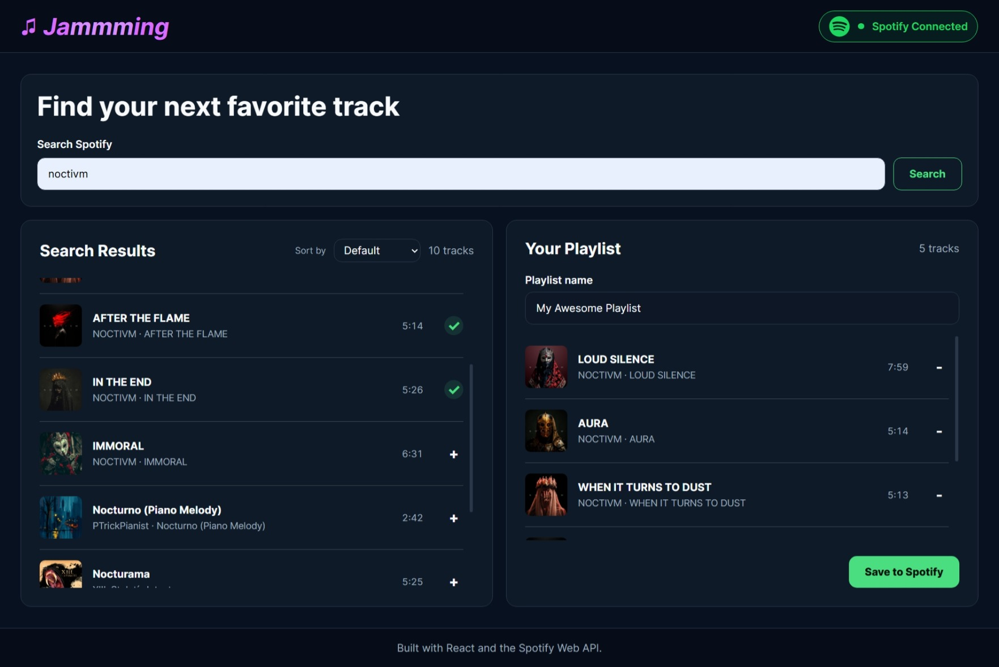
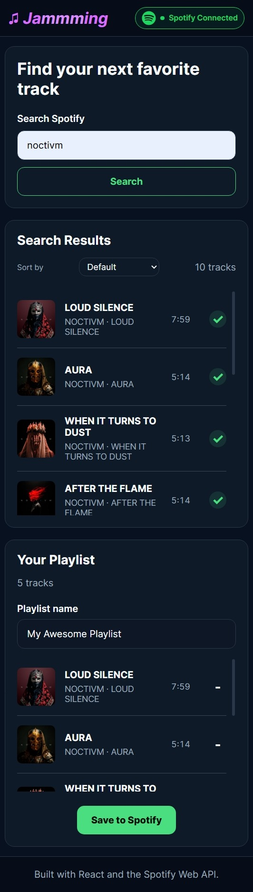

# 🎵 Jammming

A responsive React web application that allows users to search for tracks using the Spotify Web API, build and reorder custom playlists, and save them directly to their Spotify account.

Jammming was built as a front-end project to practice React, API integration, OAuth authentication, state management, asynchronous JavaScript, and responsive UI development.

---

## ✨ Features

- 🔐 Connect securely to Spotify using OAuth 2.0 with PKCE
- 🔎 Search Spotify for tracks
- ↕️ Sort search results by track, artist, album, or duration
- ➕ Add tracks to a custom playlist
- ➖ Remove tracks from the playlist
- ↕️ Reorder playlist tracks using drag and drop
- ✏️ Customize the playlist name
- 💾 Save playlists directly to the connected Spotify account
- 🔄 Automatically refresh expired Spotify access tokens
- 🔗 Open tracks directly in Spotify
- 🔔 Toast notifications for user feedback and errors
- 💀 Skeleton loading interface while searching
- 🟢 Spotify connection status indicator
- 📱 Responsive layout for desktop and mobile devices

---

## 📸 Screenshots

### Desktop



### Mobile



---

## 🛠️ Technologies

- **React 19**
- **JavaScript (ES6+)**
- **CSS3**
- **Vite**
- **Spotify Web API**
- **OAuth 2.0 with PKCE**
- **React Icons**
- **HTML5 Drag and Drop API**
- **ESLint**

---

## 🚀 How It Works

1. Connect your Spotify account.
2. Search for a song, artist, or album.
3. Browse and sort the returned Spotify tracks.
4. Add tracks to your playlist.
5. Drag and drop tracks to change their order.
6. Enter a custom playlist name.
7. Save the playlist directly to Spotify.

Tracks can also be opened in Spotify from the application.

---

## 🔐 Spotify Authentication

Jammming uses the **OAuth 2.0 Authorization Code Flow with PKCE (Proof Key for Code Exchange)** to authenticate users with Spotify.

PKCE allows the application to authenticate directly from the browser without storing a Spotify client secret in the front end.

After authentication, the application manages:

- Spotify access tokens
- Refresh tokens
- Token expiration
- Automatic access-token refresh

This allows the user to continue using the application when an access token expires without manually reconnecting to Spotify.

---

## 📁 Project Structure

```text
JAMMING/
│
├── public/
│   ├── favicon.svg
│   └── icons.svg
│
├── screenshots/
│   ├── jamming-desktop.png
│   └── jamming-mobile.png
│
├── src/
│   ├── components/
│   │   ├── Footer/
│   │   ├── Header/
│   │   ├── Playlist/
│   │   ├── SearchBar/
│   │   ├── SearchResults/
│   │   ├── SearchSkeleton/
│   │   ├── Toast/
│   │   ├── Track/
│   │   └── TrackList/
│   │
│   ├── services/
│   │   └── Spotify.js
│   │
│   ├── App.css
│   ├── App.jsx
│   ├── index.css
│   └── main.jsx
│
├── .env
├── .gitignore
├── eslint.config.js
├── index.html
├── package-lock.json
├── package.json
├── README.md
└── vite.config.js
```

---

## ⚙️ Installation

### 1. Clone the repository

```bash
git clone <your-repository-url>
cd jamming
```

### 2. Install dependencies

```bash
npm install
```

### 3. Create a Spotify application

Create an application in the Spotify Developer Dashboard.

Copy the **Client ID** from your Spotify application.

### 4. Configure the redirect URI

Add the following redirect URI to your Spotify application:

```text
http://127.0.0.1:5173/
```

The redirect URI configured in Spotify must match the URI used by the application.

### 5. Configure the environment variable

Create a `.env` file in the project root:

```env
VITE_SPOTIFY_CLIENT_ID=your_spotify_client_id
```

Do not commit your `.env` file to version control.

### 6. Start the development server

```bash
npm run dev
```

Open:

```text
http://127.0.0.1:5173/
```

in your browser.

---

## 📜 Available Scripts

Start the development server:

```bash
npm run dev
```

Create a production build:

```bash
npm run build
```

Run ESLint:

```bash
npm run lint
```

Preview the production build locally:

```bash
npm run preview
```

---

## 🎯 What I Learned

Building Jammming helped strengthen my understanding of:

- Building reusable React components
- Managing application state with React hooks
- Passing data and callbacks through props
- Handling asynchronous API requests
- Integrating a third-party REST API
- Implementing OAuth 2.0 authentication with PKCE
- Managing access and refresh tokens
- Handling token expiration automatically
- Creating loading, success, and error UI states
- Implementing drag-and-drop interactions
- Designing responsive layouts
- Improving accessibility with semantic HTML and ARIA attributes
- Structuring a React application into components and services

---

## 🔮 Future Improvements

Possible future improvements include:

- Advanced filtering options
- Improved drag-and-drop support for touch devices
- Additional Spotify playlist management features
- Automated testing

---

## 👤 Author

**Amira Ben Ameur**

PhD Researcher in Transportation Engineering | Front-End Developer

GitHub:
https://github.com/amirabenameur3

---

## 📄 Disclaimer

This project uses the Spotify Web API but is not affiliated with, sponsored by, or endorsed by Spotify.
