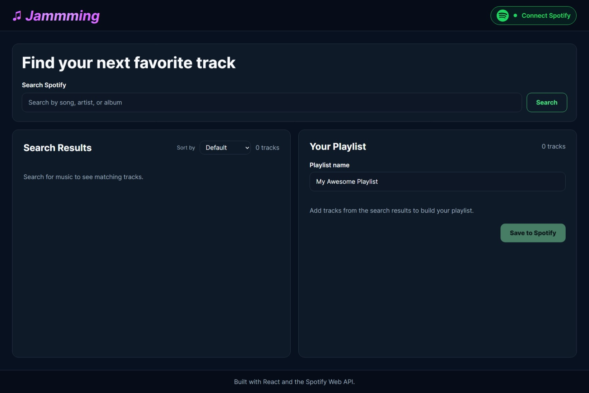

<p align="center">
  
</p>

<h1 align="center">🎵 Jammming</h1>

<p align="center">
  
</p>

<p align="center">
  A modern and responsive React application for searching Spotify tracks, building custom playlists, reordering tracks, and saving playlists directly to Spotify.
</p>

<p align="center">
  
  
  
  
  
  
  
  
</p>

<p align="center">
  
  
  
</p>

<p align="center">
  <a href="https://amirabenameur3.github.io/Jammming/">
    
  </a>
</p>

---

# 📖 Project Overview

Jammming is a modern React music application designed to let users search Spotify's music catalog, build custom playlists, and save them directly to their Spotify account.

The application integrates with the Spotify Web API to provide track search, playlist creation, Spotify account authentication, and direct links to tracks. It uses OAuth 2.0 with PKCE for secure browser-based authentication and automatically refreshes expired access tokens to maintain the user session.

The project evolved from a basic playlist-building application into a more complete and responsive Spotify experience featuring sortable search results, drag-and-drop playlist reordering, duplicate-track prevention, loading skeletons, toast notifications, Spotify connection status, and reusable React components.

---

## ✨ Features

- 🔐 **Spotify authentication** — Secure OAuth 2.0 Authorization Code Flow with PKCE
- 🔎 **Track search** — Search Spotify's music catalog
- ↕️ **Sorting** — Sort results by track, artist, album, or duration
- ➕ **Playlist building** — Add and remove tracks with duplicate prevention
- ↕️ **Drag and drop** — Reorder tracks directly inside the playlist
- ✏️ **Custom playlist names** — Rename playlists before saving
- 💾 **Save to Spotify** — Create playlists directly in the connected Spotify account
- 🔄 **Automatic token refresh** — Refresh expired access tokens without interrupting the session
- 🟢 **Connection status** — Clear Spotify connected/disconnected state
- 🔗 **Spotify links** — Open tracks directly in Spotify
- 🔔 **Toast notifications** — Feedback for authentication, saving, and errors
- 💀 **Skeleton loading** — Loading feedback while Spotify search results are retrieved
- 📱 **Responsive design** — Optimized layouts for desktop and mobile devices

---

## 📸 Screenshots

### Desktop


### Mobile

<p align="center">
  
</p>

---

## 🛠️ Technologies

| Technology | Purpose |
| --- | --- |
| React 19 | Component-based user interface |
| JavaScript (ES6+) | Application logic |
| CSS3 | Styling and responsive design |
| Vite 8 | Development and build tooling |
| Spotify Web API | Track search and playlist creation |
| OAuth 2.0 + PKCE | Spotify authentication |
| React Icons | Interface icons |
| HTML5 Drag and Drop API | Playlist track reordering |
| ESLint | Code quality and linting |

---

## 🚀 How It Works

1. **Connect to Spotify** using the Spotify authentication button.
2. **Search** for a track, artist, or album.
3. **Sort** the search results when needed.
4. **Add tracks** to your custom playlist.
5. **Drag and drop** playlist tracks to reorder them.
6. **Choose a playlist name.**
7. **Save the playlist** directly to your Spotify account.

Track artwork can also be used to open the corresponding track in Spotify.

---

## 🔐 Spotify Authentication

Jammming uses the **OAuth 2.0 Authorization Code Flow with PKCE (Proof Key for Code Exchange)**.

PKCE is designed for applications that cannot securely store a client secret, such as browser-based front-end applications.

During authentication, Jammming generates a code verifier and code challenge before redirecting the user to Spotify. After authorization, the returned authorization code is exchanged for an access token.

The application manages:

- Access tokens
- Refresh tokens
- Token expiration
- Automatic access-token renewal

When an access token expires, Jammming attempts to refresh it automatically so the user can continue searching and saving playlists without reconnecting manually.


---

## 📁 Project Structure

```text
JAMMMING/
│
├── public/
│   ├── favicon.svg
│   └── icons.svg
│
├── screenshots/
│   ├── jamming-desktop.png
│   └── jamming-mobile.png
│
├── src/
│   ├── components/
│   │   ├── Footer/
│   │   ├── Header/
│   │   ├── Playlist/
│   │   ├── SearchBar/
│   │   ├── SearchResults/
│   │   ├── SearchSkeleton/
│   │   ├── Toast/
│   │   ├── Track/
│   │   └── TrackList/
│   │
│   ├── services/
│   │   └── Spotify.js
│   │
│   ├── App.css
│   ├── App.jsx
│   ├── index.css
│   └── main.jsx
│
├── .env
├── .gitignore
├── eslint.config.js
├── index.html
├── package-lock.json
├── package.json
├── README.md
└── vite.config.js
```

---

## ⚙️ Installation

### 1. Clone the repository

```bash
git clone https://github.com/amirabenameur3/Jammming.git
cd Jammming
```

### 2. Install dependencies

```bash
npm install
```

### 3. Create a Spotify application

Create an application through the Spotify Developer Dashboard and copy its **Client ID**.

### 4. Configure the redirect URI

For local development, add the following redirect URI to your Spotify application:

```text
http://127.0.0.1:5173/
```

The redirect URI registered with Spotify must match the URI used by the application.

### 5. Configure the environment variable

Create a `.env` file in the project root:

```env
VITE_SPOTIFY_CLIENT_ID=your_spotify_client_id
```

> The `.env` file is excluded from version control and should not be committed.

### 6. Start the application

```bash
npm run dev
```

Then open:

```text
http://127.0.0.1:5173/
```
---

## 📜 Available Scripts

```bash
npm run dev
```

Starts the Vite development server.

```bash
npm run build
```

Creates the production build.

```bash
npm run lint
```

Runs ESLint across the project.

```bash
npm run preview
```

Locally previews the production build.

---

## 🎯 What I Learned

Building Jammming strengthened my understanding of:

- Designing reusable React components
- Managing state with React hooks
- Passing data and callbacks through props
- Handling asynchronous operations
- Working with third-party REST APIs
- Implementing OAuth 2.0 authentication with PKCE
- Managing access and refresh tokens
- Handling authentication expiration
- Building loading, success, and error states
- Implementing drag-and-drop interactions
- Structuring React applications into components and services
- Creating responsive interfaces
- Improving accessibility with semantic HTML and ARIA attributes
- Managing environment variables in Vite

---

## 🔮 Future Improvements

Potential improvements for future releases include:

- Enhanced search filtering
- Touch-friendly playlist reordering
- Additional Spotify playlist management features
- Automated component and integration testing

---

## 👤 Author

**Amira Ben Ameur**

PhD Researcher in Transportation Engineering | Front-End Developer

GitHub:
https://github.com/amirabenameur3

Front-end development portfolio project.

---

## 📄 Disclaimer

Jammming uses the Spotify Web API but is not affiliated with, sponsored by, or endorsed by Spotify.